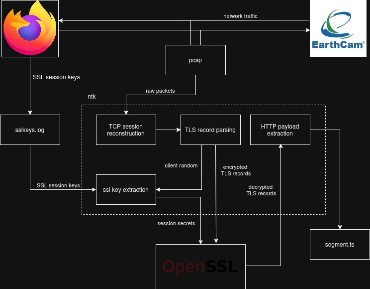

# Description

- Reconstructs TCP sessions from captured network packets.
- Extracts and decyprts TLS traffice.

# Processing Pipeline

<p align="center">
  
</p>

Each stage of the pipeline has a specific role and is loosely coupled, promoting testability and flexibility.

The pipeline can be split into three main sections:
- Packet capture and buffering.
- TCP session reconstruction
- TCP session offloading and post-processing.

## Packet Capture and Buffering
The <code>packet_listener</code> and <code>ring_buffer</code> work together to prevent packet-loss when network traffic is high or processing time is long.

<table>
  <tr>
    <td><code>packet_listener</code></td>
    <td style="padding-left: 20px;">
      <strong>Purpose:</strong><br>
      Captures raw packets from a network device using libpcap.<br><br>
      <strong>Design:</strong><br>
      - Takes a callback that controls the transfer of packets to a buffer.<br>
      - Callback should be light-weight to prevent packet loss.<br><br>    std::vector<uint8_t> pkt;
    if (ring_buff.pop(pkt)) {  // or ring_buff.try_pop(pkt) depending on your API
        live_stream_session.process_packet(pkt);
    }
      <strong>Key Members:</strong><br>
      - <code>m_callback</code>: called with each incoming packet.<br>
      - <code>m_device_name</code>, <code>m_filter_exp</code>: used to configure capture.<br>
    </td>
  </tr>
  <tr>
    <td><code>ring_buffer&lt;T,N&gt;</code></td>
    <td style="padding-left: 20px;">
      <strong>Purpose:</strong><br>
      Lock-free circular queue to buffer packets between threads.<br><br>
      <strong>Design:</strong><br>
      - Thread-safe via atomics.<br>
      - Pushes and pops are non-blocking.<br>
    </td>
  </tr> 
</table>

## TCP Session Reconstruction

<table>
  <tr>
    <td><code>tcp_live_stream_session</code></td>
    <td style="padding-left: 20px;">
      <strong>Purpose:</strong><br>
      Reconstructs TCP sessions from incoming packets.<br><br>
      <strong>Design:</strong><br>
      - Mainatains a set of <code>tcp_live_stream</code> objects, indexed by <code>four_tuple</code> ( IP/Port pairs).<br>
      - When a stream is marked complete, it's then offloaded to a queue.<br><br>
      <strong>Inferface:</strong><br>
      - Accepts packets through <code>feed()</code>.<br>
      - Offloads complete streams to a <code>transfer_queue_interface<tcp_live_stream></code>.<br>
    </td>
  </tr>
  <tr>
    <td><code>tcp_live_stream</code></td>
    <td style="padding-left: 20px;">
      <strong>Purpose:</strong><br>
      Models a single live TCP connection.<br><br>
      <strong>Design:</strong><br>
      - Accepts packets from a connection indicated by <code>m_four_tuple</code>.<br>
      - Tries to detect a valid TCP handshake and TCP termination sequence.<br>
      - Adds all packets between a valid handshake and termination sequence to <code>m_traffic</code>.<br>
      - Marks itself as complete when a valid TCP termination is detected.<br>
    </td>
  </tr> 
</table>

## TCP Session Offloading and Post-Processing

<table>
  <tr>
    <td><code>spmc_transfer_queue&lt;T,Filter&gt;</code></td>
    <td style="padding-left: 20px;">
      <strong>Purpose:</strong><br>
      Thread-safe queue with optional filtering for handing off completed streams.<br><br>
      <strong>Design:</strong><br>
      - Implements <code>transfer_queue_interface<T></code>.<br>
      - Supports an optional <code>Filter</code> template parameter that determines whether to accept an item.<br>
      - Uses <code>std::queue</code>, <code>std::mutex</code>, and <code>condition_variable</code> to allow blocking or timed popping.<br><br>
    </td>
  </tr>
  <tr>
    <td><code>stream_processor</code></td>
    <td style="padding-left: 20px;">
      <strong>Purpose:</strong><br>
      Consumes completed TCP streams ( from the <code>spmc_transfer_queue</code> ) and processes them using a user-supplied callback.<br><br>
      <strong>Design:</strong><br>
      - Pulls <code>tcp_live_stream</code> objects from the queue using blocking or timed methods.<br>
      - When a stream is retrieved, it calls <code>m_callback(stream)</code> - where <code>m_callback</code> is user-supplied.<br>
    </td>
  </tr> 
</table>

## UML Diagram

<p align="center">
  
</p>

## Example Usage

```cpp
#include <packet_listener.hpp>
#include <ring_buffer.hpp>
#include <tcp.hpp>
#include <spmc_queue.hpp>
#include <stream_processor.hpp>

std::string timestamp_filename() {
    auto now = std::chrono::system_clock::now();
    std::time_t now_c = std::chrono::system_clock::to_time_t(now);
    
    std::tm tm = *std::localtime( &now_c );
    std::ostringstream oss;
    oss << std::put_time( &tm, "%Y-%m-%d_%H-%M-%S" ) << ".txt";
    return oss.str();
}

int main() {

  using packet = std::vector<uint8_t>;
  const size_t ring_buffer_capacity = 1000;

  ntk::ring_buffer<packet,ring_buffer_capacity> ring_buff;

  auto packet_callback = [&]( const struct pcap_pkthdr* header, const unsigned char* packet ) {
    std::vector<uint8_t> vec( packet, packet + header->caplen );
`   ring_buff.push( vec );
  };

  auto stream_callback = [&]( ntk::tcp_live_stream&& live_stream ) {
    std::string filename = timestamp_filename();
    ntk::output_stream_to_file( filename, live_stream );
  };

  ntk::packet_listener listener( "wlo1", "tcp port 443" );
  listener.start( packet_callback);

  ntk::tls_filter filter; // Filter example: only accept TLS traffic
  ntk::spmc_transfer_queue<ntk::tcp_live_stream,ntk::tls_filter> offload_queue( filter );
  ntk::tcp_live_stream_session live_stream_session( &offload_queue );

  ntk::stream_processor processor( &offload_queue, stream_callback );

  listener.start();
  processor.start();

  while ( true ) {
    std::vector<uint8_t> packet;
    if ( ring_buff.pop( packet ) ) {  
        live_stream_session.feed( packet );
    }
  }

  return 0;
}
```

# HTTPS Decryption and Extraction

<p align="center">
  
</p>

<figure style="text-align: center;">
  
  <figcaption>segment.ts</figcaption>
</figure>
