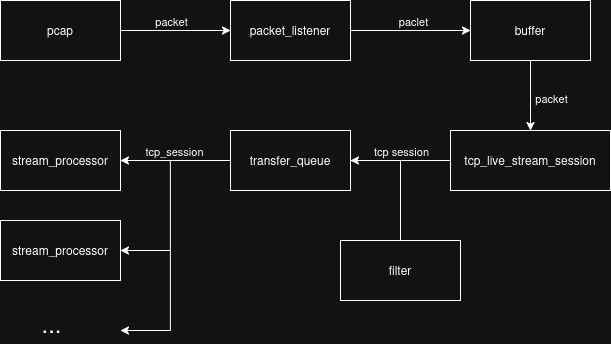
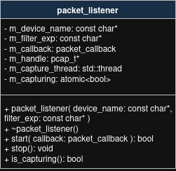
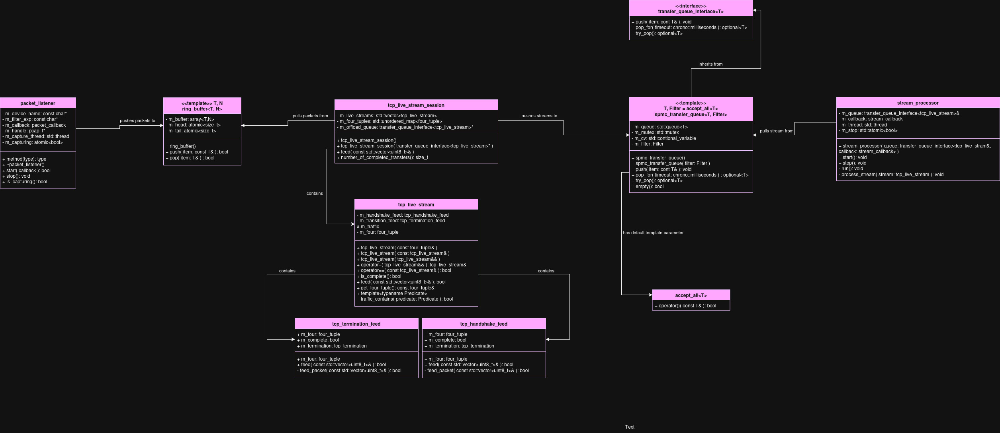
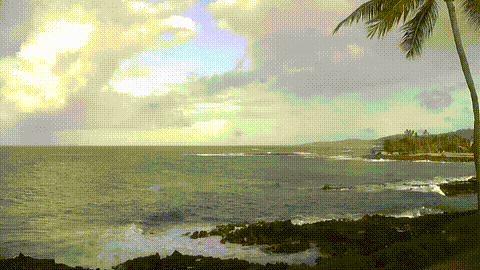

# Processing Pipeline

<p align="center">
  
</p>

Each stage has a specific role and is loosely couply, promoting testability and flexibility.

## Packet Capture and Buffering
The packet_listener and ring_buffer work together to prevent packet-loss when network traffic is high or processing time is long.

### packet_listener
<p align="center">
  
</p>
<strong>Purpose:</strong> Captures raw  packets from a network device using libpcap.<br><strong>Design:</strong><br>- Takes a callback that controls the transfer of packets to a buffer.<br>- Callback should be light-weight to prevent packet loss.<br><strong>Key Members:</strong><br>-```m_callback```: called with each incoming packet.
- m_device_name, m_filter_exp: used to configure capture.
### ring_buffer<T,N>
Purpose: lock-free circular queue to buffer packets between threads.

Design:
- Thread-safe via atomics.
- Pushes and pops are non-blocking.

### tcp_live_stream_session
Purpose: Reconstructs TCP flows form incoming packets.

Design:
- Mainatains a set of tcp_live_stream objects, indexed by four_tuple ( IP/Port pairs).
- When a stream is marked complete, it's offloaded to a queue.
Inferface:
- Accepts packets through feed().
- Offloads complete streams to a transfer_queue_interface<tcp_live_stream>.

### tcp_live_stream
Purpose: models a single live TCP connection.

Design:
- Accepts packets from a connection indicated by m_four_tuple.
- Tries to detect a valid TCP handshake and TCP termination sequence.
- Adds all intermediate packets to m_traffic.
- Marks itself as complete when a valid TCP termination sequence is detected.

### spmc_transfer_queue<T,Filter>
Purpose: thread-safe queue with optional filtering for handing off completed streams.

Design:
- Implements transfer_queue_interface<T>
- Supports an optional Filter template parameter that determines whether to accept an item.
- Uses std::queue, std::mutex, and condition_variable to allow blocking or timed popping.


## UML Diagram

<p align="center">
  
</p>

## Example Usage

```cpp
#include <packet_listener.hpp>
#include <ring_buffer.hpp>
#include <tcp.hpp>
#include <spmc_queue.hpp>
#include <stream_processor.hpp>

int main() {

  using packet = std::vector<uint8_t>;
  const size_t ring_buffer_capacity = 1000;

  ntk::ring_buffer<packet,ring_buffer_capacity> ring_buff;

  auto packet_callback = [&]( const struct pcap_pkthdr* header, const unsigned char* packet ) {
    std::vector<uint8_t> vec( packet, packet + header->caplen );
`   ring_buff.push( vec );
  };

  auto stream_callback = [&]( ntk::tcp_live_stream&& live_stream ) {
    ntk::out
  };

  ntk::packet_listener listener( "wlo1", "tcp port 443" );
  listener.start( packet_callback);

  ntk::tcp_live_stream_session live_stream_session;

  ntk::tls_filter filter;
  ntk::spmc_transfer_queue<ntk::tcp_live_stream,ntk::tls_filter> offload_queue( filter );
  ntk::tcp_live_stream_session live_stream_session( &offload_queue );

  

  return 0;
}
```

<p align="center">
  
</p>
